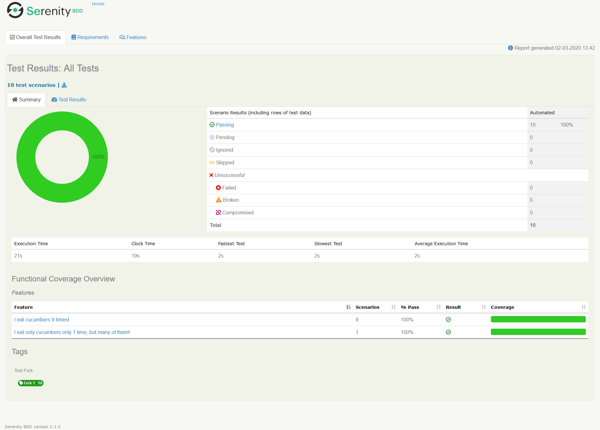

Example of forking Serenity-Cucumber tests with Gradle.

Find full documentation with details here: https://serenity-bdd.github.io/theserenitybook/latest/serenity-parallel-batches.html

##### Motivation
The documentation above describes a different approaches to parallel `Serenity-Cucumber` tests using Maven. There are 2 strategies to parallel tests: *batching* (parallelization across different machines) and *forking* (parallelization within 1 machine), which can be either combined or not.

It is pretty obvious how to apply batching strategy, but is not very clear how to use *forking*, because for forking specific `maven-failsafe-plugin` mechanizm is used.

With a little glue code & Gradle configuration it's simple to use forking with Gradle without failsafe plugin (just create enough copies of cucumber runner classes).

##### Description
Demo project contains 2 feature files - one with 9 scenarios & one with 1 scenario. Each scenario consists of 1 step with 2 sec delay.

Parallelization is applied by providing Serenity property `-Dserenity.fork.count=N` where N is desired number of forks. Maximum number of forks available depends on number of confiugred `FeatureSlicedRunner` classes.

<details><summary>Solution for cucumber 4.2.0</summary>
<p>
Create some Cucumber runner classes, and also attach to them plugin `com.github.scormaq.SerenityCucumberForker` (the trick with plugin allows us to use `@BeforeAll` mechanizm, so we will set `serenity.fork.number` at runtime (sic!) but before slicing starts)
</p>
</details>

##### Demo
Run command:
```cmd
gradlew clean test aggregate -Dserenity.fork.count=5
```
(`serenity.fork.count` is intentionally incorrect - as there only 3 Cucumber runners exist, fork count will be reduced to 3 in gradle build script).
<details><summary>Report</summary>
<p>

</p>
</details>


And without forking:
```cmd
gradlew clean test aggregate
```
<details><summary>Report</summary>
<p>

</p>
</details>